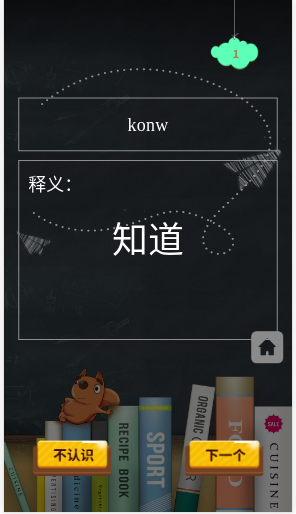

# 说明
> 此项目fork自[bailicangdu]("https://github.com/bailicangdu/vue2-happyfri")
>在其基础上进行了部分修改用作个人背单词训练使用。

### 界面如下




## 项目运行（nodejs 6.0+）

``` bash
# 克隆到本地
git clone https://github.com/wisdomDu/vue2-happyfri.git

# 安装依赖
npm install

# 开启本地服务器localhost:8088
npm run dev

# 发布环境
npm run build
```
